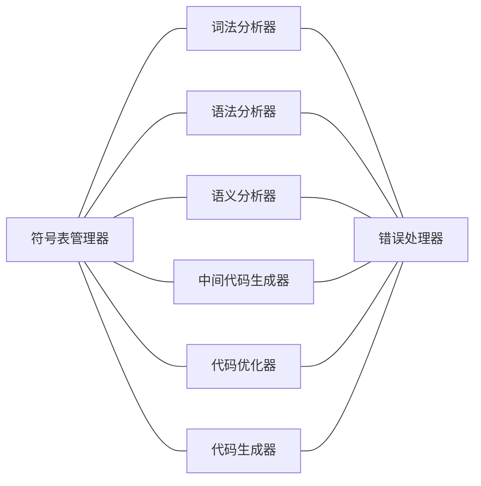

# 编译原理Compilers Principles, Techniques, and Tools

### 龙书的李建中教授翻译版

# —————2019/7/11—————

---

# 第一章：编译简介

编写编译器的原理和技术具有十分普遍的意义，编译器的编写涉及到程序设计语言、计算机体系结构、语言理论、算法和软件工程等学科

## 1.1编译器

编译器是一个程序，它读入用某种语言（源语言）编写的程序并将其翻译成一个与之等价的以另一种语言（目标语言）编写的程序。作为这个翻译过程的一个重要组成部分，编译器能够向用户报告被编译的源程序中出现的==错误==

```
			+-----------+
源程序 ————> |   编译器   |  ----> 目标程序
			+-----+-----+
			      |
			      v
			   错误信息
```

目前，世界上存在着数千种源语言，目标语言也同样广泛。目标语言可以是另一种程序设计语言，或者是从微处理机到超级计算机的任何计算机的机器语言

根据编译器的构造方法或者它们要实现的功能，编译器分为一遍编译器、多遍编译器、装入并执行编译器、调试编译器、优化编译器等多种类型

### 1.1.1 编译的分析-综合模型

#### 编译由两部分组成：==分析与综合==

分析部分将源程序切分成一些基本块并形成源程序的中间表示，综合部分把源程序的中间表示转换为所需的目标程序。==综合部分需要大量的专门化技术==

在分析期间，源程序所蕴含的操作将被确定下来并被表示成为一个称为==语法树的分层结构==。语法树的每个节点表示一个操作，该节点的子节点表示这个操作的参数

```
//position:=initial+rate*60
       :=
      /   \
    /       \
position     +
           /  \
         /      \
       initial   *
                /  \
              /      \
            rate     60
```

许多操纵源程序的软件工具都首先完成某种类型的分析

+ 结构编辑器：结构编辑器将一个命令序列作为输入来构造一个源程序。结构编辑不仅实现普通的文本编辑器的文本创建和修改功能，而且还对程序文本进行分析，==为源程序构造恰当的层次结构==。结构编辑器能够完成程序准备过程中所需要的功能。例如，检查输入的格式是否正确，自动地提供关键字，能够从begin或者左括号跳转到与之匹配的end或者右括号。这类编辑器的输出常常类似于一个编译器的分析阶段的输出
+ 智能打印机：对程序进行分析，打印出==结构清晰==的程序。例如，注释以一种特殊的字体打印，根据各个语句在程序的层次结构中的嵌套深度来缩排这些语句
+ 静态检查器：静态检查器读入一个程序，分析这个程序，并在==不运行这个程序的条件下试图发现程序的潜在错误==。比如，静态检查器可以查出源程序中永远不能被执行的语句，也可以查出变量在被定义以前被引用，还可以捕获诸如将实型变量用作指针这样的逻辑错误
+ 解释器：解释器不是通过翻译来产生目标程序，而是==直接执行源程序中蕴含的操作==。例如对于一个赋值语句，解释器先建立一个语法树，然后遍历这棵树来执行节点上的操作

下面的每一个例子中的分析部分都与传统观念中的编译器的分析部分相似

- 文本格式器text formatter：输入是字符流，流中的多数字符串是需要排版输出的字符串，同时字符流中也包含一些用来说明字符流中的段落、图表或者上标和下标等数学结构的命令
- 硅编译器silicon compiler：输入一个源程序，该语言中的变量不是内存的地址，而是开关电路中的逻辑符号（0或1）或符号组，输出是一个以适当语言书写的电路设计
- 查询解释器query interpreter：把含有关系和布尔运算的谓词翻译成数据库命令，在数据库中查询满足该谓词的记录

### 1.1.2 编译器的前驱和后继

为了建立可执行的目标程序，除了编译器以外，还需要几个其他的程序：源程序可能被分成模块存储在不同的文件中，==把存储在不同文件中的程序模块集成为一个完整的源程序==这个任务由一个称为预处理器的程序完成。预处理器也能够把源程序中称为宏的缩写语句展开为原始语句加入到源程序中

源程序梗概 —> **预处理器** —>源程序 —> **编译器** —> 目标汇编程序 —> **汇编器** —> 可重定位机器代码 —> **装载器/连接-编辑器** —> 绝对机器代码

一个典型的“编译”过程，由编译器创建的目标程序需要进一步处理才能运行。编译器产生汇编代码，汇编代码需要由汇编器翻译成机器代码，然后与一些库程序连接在一起形成可在计算机上运行的代码

---

## 1.2 源程序分析

在编译中，源程序的分析过程由如下三个阶段组成

+ 线性分析。在线性分析中，从左到右地读构成源程序的字符流，而且把字符流==分组为多个**记号token**==，而记号是具有整体含义的字符序列
+ 层次分析。字符串或记号在层次上划分为==具有一定层次的多个嵌套组==，每个嵌套组具有整体的含义
+ 语义分析。要进行某些检查，以确保程序各个组成部分确实是==有意义地组合在一起的==

### 1.2.1 词法分析

**线性分析**又被称为**词法分析**或者**扫描**。被分组为记号组，分隔这些记号的字符的空格将被删除

### 1.2.2 语法分析

**层次分析**被称为**语法分析**（parsing或者syntax analysis）它把源程序的记号进一步分组，产生被编译器用于生成代码的语法短语。通常，源程序的语法短语用分析树来表示

程序的层次结构通常是通过递归规则来表达的。比如，可能把下述的规则作为表达式定义的一部分：

+ 任何一个标识符identifier都是表达式
+ 任何一个数number都是表达式
+ 如果expression1和expression2是表达式，则expression1 + expression2、expression1 * expression2、（expression1）也是表达式

规则3通过将运算符用到其他表达式上递归地定义了表达式

类似地，许多语言用下列规则来递归地定义语句：

1.如果identifier1是一个标识符，expression2是一个表达式，则
identifier1:=expression2是一个语句
2.如果expression1是一个表达式，statement2是一个语句，则
while (expression1) do statement2、if (expression1) then statement2也是语句

### 1.2.3 语义分析

该阶段检测源程序的语义错误，并收集代码生成阶段要用到的类型信息。语义分析利用语法分析阶段确定的层次结构来识别表达式和语句中的操作符和操作数

语义分析的一个重要组成部分是==类型检查==。类型检查负责检验每个操作符的操作数是否满足源语言的说明

### 1.2.4 文本格式器中的分析

将文本格式器的输入看成是由多个盒子构成的层次结构的说明是有益的，一个盒子是一个用某种位模式填充的矩形区域，填充的位模式表明该区域被输出设备打印成浅黑像素还是黑像素

文本格式器的另一个例子是用于数学公式排版的处理器，使用操作符来构建数学表达式

---

## 1.3 编译器的各阶段

概念上讲，编译器是分阶段执行的。每个阶段将源程序从一种表示转换成另一种表示。



实际上编译器的有些阶段可以合并到一起。如果几个阶段已经合并到一起，则这些阶段的中间表示不需要明确地构造出来

### 1.3.1 符号表管理

编译器的一个基本功能是记录源程序中使用的标识符并收集与每个标识符相关的各种属性信息。==标识符的属性信息==表明了该标识符的存储位置、类型、作用域等信息。当一个标识符是过程名时，它的属性信息还包括诸如参数的个数与类型、每个参数的传递方法（如传地址方式）以及返回值的类型等信息

符号表是一个数据结构。每个标识符在符号表中都有一条记录，记录的每个域对应于该标识符的一个属性。这种数据结构允许我们快速地找到每个标识符的记录，并在该记录中快速地存储和检索信息。

当源程序中的一个标识符被词法分析器识别出来时，词法分析器将在符号表中为该标识符建立一条记录。但是，标识符的属性一般不能再词法分析中确定

标识符的属性信息将由词法分析以后的各阶段陆续写入符号表，并以各种方式被使用。例如：语义分析和中间代码生成时，需要知道标识符是哪种类型，代码生成器将赋予标识符的存储位置信息写入符号表，而且代码生成器还要使用符号表中标识符的存储位置信息

### 1.3.2 错误检测与报告

各阶段检测到错误以后，必须以恰当的方式进行错误处理，使得编译器能继续运行，以检测出源程序中的更多错误，==发现错误即停止运行的编译器不是一个好的编译器==

语法分析与语义分析阶段通常能处理编译器所能检测到的大部分错误。

### 1.3.3 各分析阶段

词法分析阶段读入源程序中的字符，并将这些字符分组形成记号流，其中每个记号表示一个逻辑上相关的字符序列，如标识符、关键字、标点符号、多字符运算符等，形成一个记号的字符序列称为该记号的**词素lexeme**。某些记号需要被赋予“词法值”

在本节中，使用id1，id2，id3表示position，initial，rate以强调标识符的内部表示不同于组成标识符的字符序列。

position := initial + rate * 60将在词法分析后被表示为id1 := id2 + id3 * 60，还需要为多字符运算符:=和数字60建立记号以反映它们的内部表示

### 1.3.4 中间代码生成

某些编译器在完成语法分析和语义分析以后，产生源程序的一个==显式中间表示==，我们可以将这种中间表示看成是某种抽象机的程序。源程序的中间表示应该具有两个重要性质，一是易于产生，二是易于翻译成目标程序

源程序的中间表示有多种形式。中间表示形式的“三地址码”，类似于某种机器的汇编语言。

一般，中间表示不仅仅计算表达式，它们还必须处理控制流结构和过程调用等其他任务

### 1.3.5 代码优化

代码优化阶段试图改进中间代码，以产生执行速度较快的机器代码，有些编译器几乎没有进行代码优化。

不同编译器所产生的代码的优化程度差别很大，能够完成很大程度的代码优化的编译器称为==“优化编译器”==。优化编译器将相当多的时间都消耗在代码优化上。但是，有一些简单优化方法，它们既可以使目标程序的执行时间得到很大的缩短，又不会使编译速度降低太大。

### 1.3.6 代码生成

编译的最后一个阶段是目标代码生成，生成可重定位的机器代码或者汇编代码，在这一阶段，编译器为源程序定义和使用的变量选择存储单元，并把中间指令翻译成完全相同任务的机器代码指令序列，这个阶段的一个关键问题是==变量的寄存器分配==

## 1.4 编译器的伙伴

### 1.4.1 预处理器

预处理产生编译器的输入，一般具有以下功能：

1. 宏处理。预处理器允许用户在源程序中定义宏。宏是被经常使用的较长结构的缩写
2. 文件包含。预编译器可以把头文件包含到程序正文中。
3. “理性”预处理器。这些处理器能把现代控制流和数据结构化机制添加到比较老式的语言中。例如，如果一种语言没有while语句和if语句这样的控制结构，理性预处理器可以用内部宏定义向用户提供这类控制结构
4. 语言扩充。这类处理器通过大量的内部宏定义来增强语言的能力

宏处理器处理两种类型的语句：**宏定义**和**宏引用**。宏定义出具有唯一性的字符或者关键字来标识，宏定义包含被定义的宏的**名字**和构成其定义的**体**。通常，宏处理器允许宏定义中包含形式参数，即将被值替代的符号（这里，“值”是一个字符串）。宏的引用只需要提供宏名和实在参数。实在参数是形式参数的值。宏处理器用实在参数替代宏体中的形式参数，然后用变换后的宏体替代宏引用本身

### 1.4.2 汇编器

某些编译器产生汇编代码，汇编代码需要交给汇编器做进一步的处理。也有些编译器能够完成汇编器的工作，产生可重定位的机器代码，交给**装配器loader**或者**连接编辑器link-editor**处理

汇编代码是机器代码的容易记忆的形式，汇编代码使用名称而不是二进制代码表示操作，存储地址也用名称来表示

汇编语言也使用宏工具，汇编语言的宏工具与前面讨论过的那些宏预处理器类似

### 1.4.3 两遍汇编

最简单的汇编器对输入汇编源程序文件进行两遍扫描，每遍读输入文件一次，在第一遍扫描中，表示存储单元的所有标识符都被识别出来并存入符号表（汇编器的符号表与编译器的符号表是分开的），一个标识符的存储单元是在它第一次被遇到时分配的

在第二遍扫描中，汇编器再一次从头扫描输入文件，这一次，它将每个操作符翻译成机器语言中代表相应操作的二进制位序列，将代表存储单元的每个标识符翻译成符号表中该标识符的地址

第二遍扫描的输出是==可重定位的机器代码==。可重定位指的是装入的起始地址可以是任意的内存单元L，也就是说，如果将L加到代码的所有地址上，整个程序对所有存储地址的引用都是正确的，为此，汇编器的输出必须说明哪些指令中引用了可重定位地址

### 1.4.4 装配器和连接编辑器

通常，装配器完成程序的装入和连接编辑两项功能，装入过程包括读入可重定位机器代码，修改可重定位地址，并将修改后的指令和数据放到内存中适当的位置

连接编辑器允许我们将多个可重定位机器代码的文件组装成一个程序。这些可重定位机器代码的文件可以是多次编译的结果，其中一个或多个可能是库程序文件，库程序文件是由系统提供的，可以被任何程序使用

如果这些可重定位机器代码的文件以某种有用的方式组合在一起使用，则就可能出现**外部引用**，即一个文件中的代码引用另一个文件中的存储单元。这种引用可以是对定义在一个文件中而用于另一个文件的数据单元的引用，或者是对出现在一个文件的代码中而在另一个文件的代码中被调用的过程的入口点的引用。==可重定位的机器代码文件必须把每个外部引用的数据单元或者指令标号的信息都保存在符号表中==。

==由于事先并不知道哪些信息将被外部引用，所以，事实上必须将汇编器的整个符号表作为可重定位机器代码的一部分==

例如，如果一个文件与另一个文件一起装配，引用了b，则该引用被替代为符号表中b的地址，如4，加上代码文件的数据单元被重定位时存储地址的偏移量

---

## 1.5 编译器各阶段的分组

1.3节介绍的编辑器的各个阶段是编辑器的逻辑组织，在编辑器的实际实现中，多个阶段的任务可能被组合在一起

### 1.5.1 前端与后端

编译的多个阶段可分为==前端==和==后端==两个大的阶段。前端包括依赖于源语言并在很大程度上独立于目标机器的某些阶段或者某些阶段的某些部分。前端一般包括词法分析、语法分析、符号表的建立、语义分析、中间代码生成以及相关的错误处理。相当一部分代码优化工作也在前端完成

后端包括编译器中依赖于目标机器的阶段或某些阶段的某些部分。一般来说，后端完成的任务不依赖于源语言而只依赖于中间语言，后端主要包括代码优化、代码生成以及相关的错误处理和符号表操作

为不同的机器编写相同源语言的编译器时，人们通常采取如下的方法：首先为所有的机器编写相同的编译器前端或者采用已有的编译器前端，然后为每个机器编写编译器的后端。如果编译器的后端是精心设计的，对于不同的机器不需要做很大的重新设计。

我们可以将不同的源语言编译成同一中间语言，对不同的前端使用相同的后端，从而得到同一机器上的不同编译器。

==但是，由于不同语言的着眼点不同，这方面的研究只取得了有限的成果==

### 1.5.2 编译器的遍

编译的若干个阶段通常是以一遍来实现的，每遍读一次输入文件、产生一个输出文件。编译器的阶段组合为遍的方式千差万别，因此我们趋向于按阶段而不是按遍来讨论编译器

==多个编译阶段可被组合为编译的一遍，并且每一遍中的各编译阶段的工作是相互交错的==。例如，词法分析、语法分析、语义分析以及中间代码的生成可以被组合为一遍。这样，词法分析形成的记号流可以被直接翻译成中间代码。更详细地说，我们可以认为该编译遍是在语法分析器的管理下进行的。语法分析器根据它读到的记号识别语法结构。当它需要下一个记号时，它通过调用词法分析器获得所需的记号。一旦语法结构找出来了，语法分析器就调用中间代码生成器完成语义分析并生成中间代码的一部分

### 1.5.3 减少编译的遍数

一方面，我们希望编译的遍数越少越好，以==减少读写中间文件的时间开销==。另一方面，如果我们将多个阶段组合为一遍，我们将不得不把这些阶段的整个程序保存在内存中，因为每个阶段需要的信息的顺序可能与前面各阶段产生这些信息的顺序不同，程序的内部形式可能远远大于源程序或者目标程序。所以，==空间可能是一个很大的问题==

把某些阶段组合为一遍存在一些问题，例如，词法分析器和语法分析器之间的接口通常被限制于单个记号；另一方面，在中间表示完全生成之前，要想完成代码生成是非常困难的。例如，某些语言允许变量在声明之前被使用，类似地，多数语言都允许向前跳转的goto语句，在一个goto语句转向到的源程序语句的目标代码被生成之前，我们无法确定这个goto语句的转移地址

某些情况下，可以为某些尚不知晓的信息留下空白位置，待获得这些信息后再填上这些空白位置。通过使用==“回填”技术==，把中间代码生成和目标代码生成划归到一遍中

由于对于汇编器来说代码的中间表示和最终表示大体一样，长度也基本相同，所以在整个汇编程序长度范围内的回填并非不可能。然而在编译器中，由于中间代码需要消耗大量空间，我们必须仔细考虑回填的范围

## 1.6 编译器的构造工具

当第一批编译器被编写出来不久，用于辅助编译器编写过程的系统就出现了。这些系统通常被人们称为**编译器的编译器**、**编译器生成器**或者**翻译器编写系统**。多数这样的系统都以某种特定的语言模型为基础，适用于产生类似于该语言模型的语言的编译器

人们已经设计出了一些自动设计编译器特定构件的软件工具。这些工具使用了特殊的语言来说明和实现特定程序设计语言构件。很多工具使用了非常复杂的算法，成功的工具都把生成算法的细节隐藏起来，而且所产生的构件很容易与编译器的其他构件集成在一起

1. 分析器生成器。这类工具生成的语法分析器一般都以上下文无关文法为基础，在早期的编译器中，语法分析不仅占据了整个编译器运行时间的相当大部分，而且在编译器的编写工作中也占了相当大的比重。现在，使用分析器生成器工具，这个阶段已经非常容易实现。==许多分析器生成器利用了功能强大的分析算法，这些算法非常复杂，单靠手工是无法完成的==
2. 扫描器生成器。这类工具一般都根据以正规表达式为基础的说明自动生成词法分析器，这类工具产生的词法分析器的基础组织结构等效于有穷自动机
3. 语法制导翻译引擎。这类工具产生一系列的翻译程序，这些翻译程序遍历分析树，并在遍历分析树的同时产生中间代码。基本思想是为分析树的每个节点关联一个或多个“翻译”，每个翻译都由树中该节点的邻节点上的翻译来定义
4. 自动代码生成器。这类工具以一个规则集合为输入，这些规则定义了中间语言的每个操作到目标机器的机器语言的翻译。这些规则必须包含足够详尽的信息以便我们能够处理数据的不同存取方法。这类工具使用的基本技术是“模板匹配”。中间代码语句被表示机器指令序列的“模板”替代
5. 数据流引擎。完成高质量代码优化所需要的很多信息都包含“数据流分析”，数据流分析收集有关值如何从程序的一个部分传递到程序的其他部分的信息。不同的任务均可由基本相同的程序来完成，只需用户提供中间代码语句与被收集信息之间关系的细节

理论研究对编译器技术的开放产生了深远的影响

#### 语法分析的魅力或许早已褪色，但编译技术一直是一个活跃的研究课题


---

# 个人疑问的解答

#### 1. 第一个编译器是什么时候出现的

我们很难说出第一个编译器出现的准确时间，因为最初的很多实验和实现是由不同的工作小组独立完成的。==编译器的早期工作主要集中在如何把算术表达式翻译成机器代码==

#### 2. 最早的编译器是怎么编写的

20世纪50年代，编译器的编写一直被认为是一个极难的问题，比如Fortran的第一个编译器==花了18人3年==才得以实现[1954-1957]。目前，我们已经系统地掌握了处理编译期间发生的许多重要任务的技术。良好的实现语言、程序设计环境和软件工具也已经被开发出来，借助于这些先进的技术、环境和工具，一个真正的编译器完全可以作为==一个学期==的编译器课程的学生实习项目来实现

#### 3. 解释器

由于命令语言中执行的每个操作通常都是对编辑器或编译器一类复杂例程的调用，解释器经常用于执行命令语言。一些“非常高级”的语言，通常都是解释执行的，因为有许多关于数据的信息（如数组的大小和形状）不能在编译时得到

#### 4. 在一些与语言翻译毫不相关的场合，编译技术也常常被使用

#### 5. 词法分析和语法分析的界限

词法分析和语法分析的界限==在某种程度上是不确定的==，我们通常采取能够使整个分析工作简化的方法来设定词法分析与语法分析的界限。决定词法分析和语法分析界限的因素是源语言是否具有递归结构。词法结构不要求递归，而语法结构常常需要递归。==上下文无关文法==是递归规则的一种形式化，可以用来指导语法分析

#### 6. 如何扫描

在识别源语言的标识符（由字母开头的字母和数字串）时，不需要递归，只要简单地扫描输入流就可以完成标识符的识别。一般地，直到遇见一个既不是字母也不是数字的字符时为止，在这之前扫描到的字母和数字归结为一个标识符记号，被分组的字符存储到一个称为==符号表==的表中，并将这些字符从输入中删除以便开始扫描下一个记号

#### 7. 一个例子

在机器内部，整数的二进制表示形式不同于实数的二进制表示形式。两个具有相同数值的整数与实数的机器内部表示也不相同。例如一个操作符需要应用到实数和整数上，一般的解决方法是将整数转换成实数，即创建一个额外节点inttoreal，显示地将一个整数转换成一个实数。另一种解决办法是用一个等值的实数常数来替代整数，因为inttoreal的操作数是常数

#### 8. 符号表

汇编和编译阶段都有符号表，两个符号表之间没有什么联系的

#### 9. 目前编译器的实现单靠手工是不可能实现的