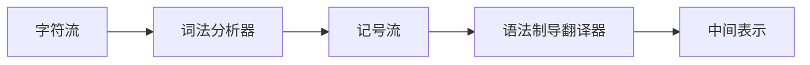

# 编译原理Compilers Principles, Techniques, and Tools

---

# —————2019/7/11—————

# 第二章：简单的一遍编译器

---

## 2.1 概述

程序设计语言可以通过描述以下两个方面来定义：第一方面是**程序模式**，即语言的语法；第二方面是**程序含义**，即语言的语义。

为了说明语言的语法，介绍一种广为使用的表示法：==上下文无关文法==或者==BNF(Backus-Nuar 范式)==。使用现有的表示法描述语言的语义要比描述语言的语法难得多。因此，在定义语言的语义时，我们将使用非形式化方法和启发性实例

上下文无关文法除了可以用于定义语言的语法之外，还可用于指导源程序的翻译。面向语法的编译技术，如==语法制导翻译技术==，对于组织编译器的前端十分有用，本章将广泛应用语法制导翻译技术

#### 语法制导翻译技术

我们将构造一个把中缀表达式转换成后缀表达式的编译器。在后缀表达式中，操作符出现在操作数的后面，例如中缀表达式9-5+2的后缀表达形式为95-2+。我们可以使用一个堆栈把后缀表达式直接转换成计算该表达式的计算机代码



我们的编译器前端的结构如上，语法制导翻译器由一个语法分析器和一个中间代码生成器构成

## 2.2 语法定义

本节介绍一种定义语言语法的表示法，称为上下文无关文法（简称文法）。上下文无关文法将贯穿本书始末，作为编译器前端定义的一部分

一个语法非常自然地描述了许多程序设计语言结构的层次结构，例如C语言中的if-else语句具有如下形式： if (表达式) 语句 else 语句

也就是说，整个语句是由关键字if，一个左括号，一个表达式，一个右括号，一条语句，关键字else，另外一条语句组成的序列。如果使用变量expr来标识表达式，使用变量stmt来标识一条语句，则if-else语句的构造规则可表达为： stmt → if (expr) stmt else stmt

这里，箭头可以读作”可以具有形式“，这样的规则称为**产生式production**。在一个产生式中，像关键字if和括号这样的词法元素称为==**记号token**==，像expr和stmt这样的变量表示一个记号序列，并称之为==**非终结符nonterminal**==

#### 上下文无关文法（简称文法）

包含如下四个部分：

1. 一个记号集合，称为==终结符号==；
2. 一个==非终结符==集合；
3. 一个产生式集合。每个产生式具有一个左部和一个右部，左部和右部由箭头连接，左部是一个非终结符，右部是记号和(或)非终结符序列
4. 一个开始符号。开始符号是一个指定的非终结符

#### 我们约定，定义语法时只需列出文法的产生式，并把以开始符号为左部的产生式列在最前面

假设：==数字、类似于<=的符号、类似于while的黑体字符串均为终结符==，斜体名字表示非终结符，任何非斜体的名字或者符号都是记号。为了表示上的方便，我们常把具有相同左部的产生式合并，写成一个生产式，其左部为所有产生式共有的那个非终结符，右部为所有产生式右部的组合，每个右部用|分隔，|读作或

如果一个非终结符出现在一个产生式的左部，该产生式称为该非终结符的产生式。==记号串是零个或者多个记号的序列。一个包含零个记号的记号串称为空串，记作ε==

从开始符号出发，反复替代产生式中的非终结符（用该非终结符的产生式的右部），一个文法可产生一个串，由一个文法的开始符号产生的记号串形成了该文法定义的语言

树中的每个节点用一个文法符号标记，一个内节点和它的所有子节点对应一个产生式。内节点对应产生式的左部，子节点对应产生式的右部。这样的树称为==分析树==

### 2.2.1 分析树

分析树描绘了如何从文法的开始符号开始推导出他的语言中的一个语句。如果非终结符A具有一个产生式A→XYZ，则A的一颗分析树如右图所示，内节点标记为A，A的三个子节点从左到右标记为X、Y和Z

+ 树根标记为开始符号
+ ==每个叶节点由记号或者ε标记==
+ 每个内节点由一个非终结符标记
+ 如果A是某个内节点的非终结符号标记，X1，X2，...，Xn是该节点从左到右排列的所有子节点的标记，则A→X1X2...Xn是一个产生式

一棵分析树从左到右的叶节点是这棵分析树生成的结果。分析树生成的结果是由根节点的非终结符生成或导出的串

#### 一个文法生成的语言是它的某个分析树生成的串的集合。为给定的记号串找到一个分析树的过程称为这个串的==语法分析parsing==

**个人理解**：记号包含终结符

### 2.2.2 二义性

在谈及根据文法建立的串的某个结构时必须谨慎

#### 一棵分析树读完它的叶节点只能生成唯一的一个串，但是一个文法可能有多棵分析树生成相同的记号串，这样的文法称为具有==二义性==的文法

在构造程序设计语言及其编译器时，需要设计无二义性文法，或者使用增加了额外的规则解决二义性问题的二义性文法

### 2.2.3 操作符的结合规则

9+5+2和(9-5)-2，操作数5左右两边都有操作符，需要决定哪个操作符使用该操作数。我们说操作符+是左结合的，因为当一个操作数左右两侧都有+号时，它将被其左部操作符使用。==在大多数的程序设计语言中，加、减、乘、除四种算术操作符都是左结合的==

某些常用操作符是右结合的，比如指数操作，C语言中的赋值运算操作符=号也是右结合的，比如表达式a=b=c等价于a=(b=c)

```
          list                             right
        /   |  \                         /   |   \
     list   -   digit                letter  =  right
   /  |  \        |                     |      /  |  \
list  -  digit    2                     a  letter =  right
  |        |                                  |        |
digit      5                                  b      letter
  |                                                    |
  9                                                    c
//9-5-2的分析树向左下端延伸            //a=b=c的分析树向右下端延伸
```

### 2.2.4 操作符的优先级

当不止一种操作符出现的时候，我们需要确定操作符之间的优先关系。在普通的算术运算中，==乘法和除法比加法和减法具有较高的优先级==，因此在表达式`9+5*2`和`9*5+2`中，操作数5都首先参与`*`运算，分别等价于表达式`9+(5*2)`和`(9*5)+2`

#### 表达式的语法

算术表达式的文法可以根据操作符的结合性和优先级表来构建。在优先级表中，操作符按照优先级递增的次序排列，相同优先级的操作符出现在同一行上：

左结合： +  -
左结合： *  /

使用两个非终结符expr和term分别表示两个不同的优先级层级，使用另一个非终结符factor产生表达式中的基本单元。表达式中的基本单元是数字和带括号的表达式

算术表达式的最终文法为：
expr→expr + term  |  expr - term  |  term
term→term * factor  |  term / factor  |  factor
factor→**digit**  | ( expr )

该文法把一个表达式看作是由+号和-号分隔的term表，把term看成是由`*`号或/号分隔的factor表。任何带括号的表达式都是一个factor

使用括号，可以构造具有任意嵌套深度的表达式（及具有任意深度的分析树）

#### 语句的语法

在多数语言中，我们==可以使用关键字识别语句==。除了赋值语句和过程调用语句以外，所有的Pascal语句都由一个关键字开始。一些Pascal语句可以用下面的二义性文法来定义，其中**id**表示一个标识符

stmt→ **id**  :=  expr
          | **if**  expr  **then**  stmt
          | **if**  expr  **then**  stmt  **else**  stmt
          | **while**  expr **do** stmt
          | **begin**  opt_stmts  **end**

非终结符opt_stmts可以产生一个由分号隔开的（可以是空的）语句表

## 2.3 语法制导翻译

为了翻译程序设计语言的某个结构，除了为该结构生成的代码以外，编译器还需要保存许多信息，这些信息称为与该结构相关的**属性**。属性可以表示任意的信息，如类型、串、内存位置等

本节给出一个称为==**语法制导定义**==的形式化方法，用以说明程序设计语言中各种结构的翻译。一个==语法制导定义==根据与其语义部分相关联的属性说明了程序设计语言的一个结构的翻译

==**翻译模式**==用来描述翻译过程。本章将翻译模式用于把中缀表达式翻译成后缀表达式

### 2.3.1 后缀表示

一个表达式E的后缀表示可以归纳地定义如下：
1.如果E是一个变量或者常量，则E的后缀表示是E本身
2.如果E是形如E1 op E2的表达式，其中op是一个二元操作符，则E的后缀表示是E1' E2' op
3.如果E是形如  (E1)  的表达式，则E1的后缀表示是E的后缀表示

因为一个表达式的操作符的位置和每个操作符的操作数的个数（参数数量）只允许==后缀表达式的一种解码方式==，所以在后缀表示中不需要括号，例如(9-5)+2的后缀表示为95-2+，9-(5+2)的后缀表示为952+-

### 2.3.2 语法制导定义（没看懂）

语法制导定义使用上下文无关文法来说明输入的语法结构。它通过每个文法符号和一个属性集合相关联，通过每一个产生式和一个语义规则集合相关联。语义规则用来计算与产生式中出现的符号相关联的属性的值。文法和语义规则集合构成了语法制导定义

翻译是一个输入到输出的映射，每个输入x的输出用下面的方式来说明，首先，构建x的分析树。假定分析树的节点n用文法符号X标识，我们用X.a表示节点n上X的属性a的值，节点n上的X.a的值是使用与X产生式相关联的属性a的语义规则来计算的。每个节点都具有属性值的分析树称为**注释分析树**

### 2.3.3 综合属性

如果分析树的某个节点的属性值是由其子节点的属性值确定的，则我们称该属性是==综合属性==。一棵分析树的所有综合属性值的计算只需要分析树的一次自底向上遍历

| 产生式            | 语义规则                               |
| ----------------- | -------------------------------------- |
| expr→expr1 + term | expr.t := expr1.t \|\| term.t \|\| '+' |
| expr→expr1 - term | expt.t := expr1.t \|\| term.t \|\| '-' |
| expr→term         | expr.t := term.t                       |
| term→0            | term.t := '0'                          |
| term→1            | term.t := '1'                          |
| ...               | ...                                    |
| term→9            | term.t := '9'                          |

与每个非终结符相关联的是一个具有字符串值的属性t，属性t表示该非终结符产生的表达式的后缀表示。语义规则中的操作符||表示字符串的连接

```
//注释分析树
//每个节点上的t属性的值用与该节点的产生式相关联的语义规则计算
//根节点的属性值是该分析树生成的串的后缀表示
                         expr.t=95-2+
                     /         |        \
       expr.t=95-              |       term.t=2
      /     |     \            |          |
expr.t=9    |     term.t=5     |          |
   |        |        |         |          |
term.t=9    |        |         |          |
   |        |        |         |          |
   9        -        5         +          2
```

### 2.3.4 深度优先遍历

语法制导定义没有规定分析树中属性的计算顺序，只是在计算属性a时，a所依赖的所有其他属性必须已经进行了计算。满足这个要求的任何计算顺序都是可以接受的。通常，在遍历一个分析树的时候，有的属性节点一经访问就必须进行计算，有的属性需要其所有的子节点都被访问以后才能计算，有的属性计算发生在访问其所有子节点的过程中

本章所有的翻译都是通过按照一种预定的顺序对分析树属性的语义规则进行计算来实现的。树的遍历是指从根开始，以某种顺序访问树的每一个节点。

本章采用深度优先遍历计算语义规则，从根开始，从左到右递归访问每个节点的子节点。一旦给定节点的所有后代都被访问，则该节点的语义规则将被计算

### 2.3.5 翻译模式

本章的其余部分用一种过程说明来定义翻译，一个==翻译模式==是一个上下文无关文法，其中被称为==语义动作==的程序段被嵌入到产生式右部。一个翻译模式类似于语法翻译制导定义，只是语义规则的计算顺序是显示给出的，一个语义动作的执行位置通过用括号把语义动作括起来并将其放在产生式右部来表示，如：rest → + term =={ print ( ' + ' ) }== rest1

翻译模式对于由基本语法产生的每个语句x都产生一个输出，方法是：按照x的分析树的深度优先遍历顺序执行语义动作。语义动作{ print ( ' + ' ) }在term子树之后，rest1子树之前执行

当我们给一个翻译模式画一棵分析树的时候，我们通过为语义动作构造一个特殊的子节点来指出语义动作，并使用虚线连接到其产生式的节点。语义动作节点没有子节点，使得该节点在第一次被访问到的时候便被执行

### 2.3.6 翻译的输出

翻译模式的语义动作把翻译的输出以一次一个字符或一个字符串的形式写入一个文件。例如，通过每次写9-5+2中一个字符的方式把表达式9-5+2翻译成95-2+，而不需要额外的空间存储子表达式的翻译。当输出按照这种方式递增地被创建时，写字符的顺序变得很重要

语义制导定义具有如下特性：每个产生式左部的非终结符的翻译是将该产生式右部的非终结符的翻译按照它们在右部出现的次序连接起来得到的，在连接过程中可能还需要附加（也可能不需要）一些额外的串，具有这样的特性的语义制导定义称之为==简单的语义制导定义==

简单语法制导定义可以用翻译模式来实现，在翻译模式中，语义动作按照定义中出现的顺序输出额外串

作为一般规则，多数分析树方法都以一种“贪心”的方式从左到右地处理输入，即在读入下一个记号之前构造尽可能多的分析树的组成部分。在简单翻译模式（由简单语义制导定义得到的）中，语义动作也是按照从左到右的顺序执行的。因此，==实现简单翻译模式时，可以在语法分析的时候执行语义动作，完全没有必要构造分析树==

## 2.4 语法分析

==语法分析是决定一个记号串是否能够由一个文法产生的过程==。编译器可能没有真正构造这样一棵分析树，语法分析器应该具有构造分析树的能力，否则，不能保证翻译的正确性

使用软件工具直接从翻译模式生成翻译器是构造翻译器的理想方法

我们可以为任何文法构造语法分析器。实际中使用的文法一般都具有特定的形式，对于任意上下文无关文法， 可以构造一个时间复杂性为O(n^3)的语法分析器，即在O(n^3)时间内完成对具有n个记号的串的语法分析。但是立方阶的事件代价太昂贵了

给定一种程序设计语言，通常可以构造一个可快速分析的文法，线性时间复杂性算法足以分析实际中出现的所有程序设计语言。程序设计语言语法分析器总是从左到右扫描输入，每次超前扫描一个记号

语法分析方法可以分为两类：**自顶向下方法**和**自底向上方法**。这些术语是指构造分析树节点的顺序。

自顶向下分析器是常用的语法分析器，其原因在于这种语法分析器可以很容易地通过自顶向下的方法手工构造出来。然而，自底向上分析方法可以处理大量文法和翻译模式，所以直接从文法产生语法分析器的软件工具通常使用自底向上的方法

### 2.4.1 自顶向下语法分析

为了自顶向下地构造一个分析树，我们从标有开始非终结符的根节点开始，反复执行下面两步：

+ 在标有非终结符A的节点n，选择A的一个产生式，用该产生式右部的符号构造节点n的子节点
+ 寻找下一个要构造子树的节点

对于某些文法，上面的步骤可以通过一次从左到右扫描输入串来实现，输入中当前被扫描的记号通常是被称为==超前扫描符号lookahead symbol==，我们也称超前扫描符号为==当前符号==。最初，超前扫描符号是输入串的第一个记号，即最左端的记号

文法：
type→simple
        | ↑ id
        | array [ simple ] of  type
simple→integer
             | char
             | num dotdot num

对如下输入串的语法分析过程：
array [ num dotdot num ] of integer

最初，记号array是超前扫描符号，分析树的已知部分只有标记为开始非终结符type的根节点。为了与输入字符串匹配，非终结字符串type必须导出一个以超前扫描符号array开始的串。在文法中，只有一个以type为左部的产生式可以导出这样的串，所以使用这个产生式来构造根节点type的子节点，并在子节点上标上产生式右部的符号 

当一个节点的子节点都已经构造完毕，从该节点的最左端子节点开始继续构造分析树的其余部分

如果当前被考查的分析树的节点是一个终结符，而且该终结符与超前符号匹配，则分析树的箭头和输入的箭头都前进一步。输入的下一个记号成为新的超前扫描符号，分析树的下一个子节点将被考查

分析树的箭头指向标记非终结符的子节点时，在考虑一个标有非终结符的节点时，将重复为这个非终结符选择一个适当的产生式的过程

通常，为非终结符选择产生式可能会涉及==“试验和错误”==的问题，即在选择产生式的时候，如果一个产生式不合适，将不得不==回溯==，测试另外一个产生式。一个产生式“不合适”是指使用了该产生式之后无法产生与输入串匹配的分析树

### 2.4.2 预测分析法

==递归下降分析法==是一种自顶向下的语法分析方法，在这种方法中，我们执行一组递归过程来处理输入串。每一个过程都唯一地与文法的一个非终结符相关联。这里，考虑一种特殊的递归下降分析法，称为==预测分析法==

在预测分析法中，超前扫描符号无二义性地确定了为每个非终结符选择的过程。处理输入时调用的过程序列隐式地定义了输入串的分析树

预测语法分析器由非终结符type的过程、非终结符simple的过程和一个称为match的过程组成。用match过程来简化type过程和simple过程的代码。如果变量t和超前扫描符号匹配，输入符号串的箭头将前进一步，指向下一个输入记号，因此，match过程改变了当前被扫描的输入记号lookahead变量的值

超前扫描符号指导产生式的选择，如果产生式的右部由一个记号开始，则当该记号与超前扫描符号匹配的时候这个产生式被选用

预测分析法依赖于产生式右部产生的第一个符号是什么

定义FIRST(α)是作为由α产生的一个或多个串的第一个符号出现的集合。如果α是ε或者可以产生ε，则ε也属于FIRST(α)

FIRST(simple) = {integer, char, num}
FIRST(↑ id) = { ↑ }
FIRST(array [ simple ] of type) = {array}

实际上，许多产生式的右部都由记号开始，从而简化了FIRST集合的构造

如果有两个产生式A→α和A→β可供选用，则必须考虑相应的FIRST集合。无回溯的递归下降分析方法要求FIRST(α)和FIRST(β)不相交，这样超前扫描符号就可以选择正确的过程去执行。如果超前扫描符号在FIRST(α)集合中，则使用α，否则，如果超前扫描符号在FIRST(β)中，则使用β

==相当于输入串为**array [ num dotdot num ] of integer**
执行到**array [ simple ] of  type**的type时，type的
FIRST(simple) = {integer, char, num}
FIRST(↑ id) = { ↑ }
FIRST(array [ simple ] of type) = {array}
中只有**FIRST(simple) = {integer, char, num}**中包含了integer
所以选用type→simple和simple→integer的产生式==

### 2.4.3 何时使用ε产生式

右部是ε的产生式称为ε产生式，需要特殊处理。当没有其他产生式可用的时候，递归下降语法分析器把ε产生式作为默认产生式使用

stmt → **begin** opt_stmts **end**
opt_stmts → stmt_list  |  ε

当分析到opt_stmts时，如果超前扫描符号没有在FIRST(stmt_list)集合中，则使用ε产生式。如果超前扫描符号是end，这种选择是正确的，除了end之外的任何超前扫描符号都将导致一个错误，可以在stmt的语法分析中检测到

### 2.4.4 设计一个预测语法分析器

预测语法分析器是一个由多个过程组成的程序，每个过程对应一个非终结符，每个过程完成如下两项任务：

+ 检查超前扫描符号，决定使用哪个产生式。如果超前扫描符号在FIRST(α)中，则选择使用右部为α的产生式。对于任何超前扫描符号，如果产生式右部存在冲突，那么不能在这种文法上使用这种分析方式。如果超前扫描符号不在任何其他右部的FIRST集合中，右部具有ε的产生式将被使用
+ 过程通过模仿其右部来使用一个产生式，一个非终结符号导致该非终结符对应的过程被调用，一个与超前扫描符号匹配的记号导致下一个输入记号被读入。如果在某个点上，产生式的记号与超前扫描符号不匹配，则报告出错

类似于通过扩展文法来形成一个翻译模式，我们也可以通过扩展预测语法分析器来形成一个语法制导翻译器。

### 2.4.5 左递归

递归下降语法分析器很可能造成无限循环，例如：expr→expr+term，这里产生式右部的最左符号和产生式左部的非终结符是相同的，假定expr对应的过程要使用这个产生式，因为右部是由expr开始的，所以expr过程被递归调用，出现了无限循环。因为，==只有右部终结符与超前扫描符号匹配时，超前扫描符号才会发生改变，因为产生式是以非终结符expr开始的，输入符号在递归调用期间没有机会改变，所以导致无限循环==

通过重写与递归相关的产生式，可以消除左递归产生式

A→Aα|β

这里α和β是不以A开始的终结符和非终结符序列，因为产生式A→Aα的右部最左面的符号是A自身，因此A是==左递归产生式==，重复应用这个产生式，在A的右部产生一个α的序列，当A最终由β替换时，β后面跟着0个或者多个α的序列

同样的结果可通过如下方式改写产生式得到

A→βR
R→αR | ε

产生式R→αR以R自身作为产生式右部最后一个符号，因而是==右递归==的。向右下侧延伸的分析树使得包含左结合操作符表达式的翻译变得十分困难

## 2.5 简单表达式的翻译器

一个语法制导翻译模式可以作为一个翻译器的规范。通常，一个给定翻译模式的文法在能够被预测语法分析器分析之前需要加以修改。==预测语法分析器不能处理左递归文法==。可以通过消除左递归得到一个适用于预测递归下降编译器的文法

### 2.5.1 抽象语法和具体语法

在一个==抽象语法树==中，每个节点表示一个操作符，该节点的子节点表示操作数。与此相对应，分析树称为==具体语法树==，相应的文法称作具体语法

在语法树中，操作符都是内节点，在分析树中，操作符都是叶节点

例如下面语法不适合将表达式翻译成后缀形式

expr → term rest
rest → + expr | - expr | ε
term → 0 | 1 | ... | 9

用下面两种模式从expr.t翻译rest.t都是无法接受的：
rest → - expr { rest.t := '-' || expr.t }
rest → - expr { rest.t := expr.t || '-' }

使用第一个，减号出现在expr.t前面，9-5翻译后还是9-5。使用第二个，操作符将一直移到右部末尾，9-5+2被错误翻译为952+-，正确翻译应该是95-2+

### 2.5.2 调整翻译模式

左递归消除技术同样可以应用到包含语义动作的产生式。将产生式A → Aα|Aβ|γ转换成
A → γR
R → αR|βR|ε

当语义动作嵌入在产生式中时，将在转换过程中一直携带这些语义动作。令A=expr，α=+term{print('+')}，β=-term{print('-')}，γ=term，则将产生下面的翻译模式

expr → term rest
rest → + term { print('+') } rest | - term { print('-') } rest | ε
term → 0 {print('0')}
term → 1 {print('1')}
...
term → 9 {print('9')}

### 2.5.3 非终结符expr、term和rest的过程

```c
expr()
{
    term(); rest();
}
rest()
{
    if (lookahead == '+') {
        match('+'); term(); putchar('+'); rest();
    }
    else if (lookahead == '-') {
        match('-'); term(); putchar('-'); rest();
    }
    else ;
}
term()
{
    if (isdigit(lookahead)) {
        putchar(lookahead); match(lookahead);
    }
    else error();
}
```

### 2.5.4 翻译器的优化

某些递归调用可以用循环替换，如果一个过程中执行的最后一条语句是对该过程的递归调用，则该调用称为是==尾递归==的。可以通过用循环代替尾递归来加速程序。使用循环后，rest函数仅由expr函数调用，因此，这两个函数可以合二为一

```c
expr()
{
    term();
    while(1)
        if (lookahead == '+') {
            match('+'); term(); putchar('+');
        }
    	else if (lookahead == '-') {
            match('-'); tern(); putchar('-');
        }
    	else break;
}
```

### 2.5.5 完整程序

`<ctype.h>`是一个标准例程文件，其中包括判定函数isdigit的代码。由单个字符构成的记号由标准库例程getchar提供，getchar读入输入文件中的下一个字符

```c
#include <ctype.h> /*加载带有判定函数isdigit的文件*/
int lookahead;

main()
{
    lookahead = getchar();
    expr();
    putchar('\n'); /*增加尾部换行符*/
}

expr()
{
    term();
    while(1)
        if (lookahead == '+') {
            match('+'); term(); putchar('+');
        }
        else if (lookahead == '-') {
            match('-'); term(); putchar('-');
        }
        else break;
}

term()
{
    if (isdigit(lookahead)) {
        putchar(lookahead);
        match(lookahead);
    }
    else error();
}

match(t)
    int t;
{
    if (lookahead == t)
        lookahead = getchar();
    else error();
}

error()
{
    printf("syntax error\n"); /*打印错误信息*/
    exit(1);    /*停止*/
}
```

函数match检查记号是否匹配，如果超前扫描符号匹配，match读入下一个输入，否则调用出错例程，报告错误信息

## 2.6 词法分析

为上节的翻译器增加一个词法分析器。词法分析器读入输入串，将其转换成将被语法分析器分析的记号流

一个语言的语句是由记号串构成的，构成一个记号的一个输入字符序列称为词素，词法分析器把语法分析器和记号的词素表示分隔开来。希望词法分析器完成的一些功能

### 2.6.1 剔除空白符和注释

许多语言允许“空白符”（空格、制表符或者换行符）出现在记号之间。源程序中的注释一般都被语法分析器和翻译器忽略，也可以看成空白符

### 2.6.2 常数

在一个表达式中，任何一个允许单个数字出现的位置都应该允许任何整形常数出现，因为整形常数是一个数字序列，我们可以通过在文法中添加产生式或者创建常数的记号使整型常数成为合法的。

由于翻译期间把数作为一个单元来处理，收集数字形成整数这一任务一般由词法分析器来完成

令num是表示整数的记号，当一个数字序列出现在输入流中时，词法分析器将把num传递给语法分析器。整数的值作为记号num的属性值传递给语法分析器。31+28+59将写成`<num,31><+,><num,28><+,><num,59>`

### 2.6.3 识别标识符和关键字

程序设计语言使用标识符作为变量名、数组名、函数名和一些其他的语言对象名。程序设计语言的文法常把标识符作为记号处理。基于这类文法的语法分析器在输入中每遇到一个标识符都赋予它们相同的记号id

例如词法分析器将输入count = count + increament; 转换为记号流id = id + id

当输入流中出现形成标识符的词素时，我们需要某种机制来决定该词素以前是否出现过，需要使用符号表，词素存储在符号表的一个表项中，而指向该表项的指针则成为记号id的一个属性

许多程序设计语言使用固定的字符串如begin、end、if等，作为标点符号标志或者某种结构的标识。这些字符串称作==关键字==，通常也满足形成标识符的规则。于是还需要一种机制来决定一个词素何时形成关键字何时形成标识符

### 2.6.4 词法分析器的接口

介于语法分析器和输入流之间，并与这两者交互

词法分析器从输入串读字符并形成词素，然后将词素生成的记号及其属性值传递给编译器的语法分析器

在某些情况下，词法分析器在把记号传给语法分析器之前，需要从输入串超前地读入一些字符，以确定需要传递给语法分析器的正确记号。例如>和>=，如果多读的一个字符未能进行组合，则多读入的字符必须退回给输入流，因为它可能是下一个词素的开始符号

词法分析器和语法分析器形成==“生产者-消费者”==对。产生的记号在被消费之前保存在记号缓冲区中。通常，缓冲区只能存储一个记号，在这种情况下，二者之间的交互可以通过下面的方式简单地实现：==使词法分析器成为语法分析器调用并为语法分析器返回所需的记号的过程==

读入字符和退回字符操作一般都通过建立一个输入缓存区来实现。编译器每次把一组字符读入缓冲区，用一个指针指向当前已经被分析的输入部分。如果需要退回字符，只需将指针向回移动。为了能够给出详细的错误信息报告，需要保存输入字符。输入字符的缓存可以提高编译器的效率，每次读一组字符比每次读一个字符的效率高

### 2.6.5 词法分析器

词法分析器的目的是使表达式中只允许出现空白符和由多个数字组成的数

​                                                         +——————+
使用getchar()读字符        ——>    |       lexan()     |  ——> 返回记号给调用者
使用ungetc(c, stdin)推回c   <—    |  词法分析器  |  ——+
​                                                         +——————+          |
​                                                                                              v
​                                           给全局变量赋值为属性值：tokenval

为了允许数出现在表达式中，用非终结符factor代替单个的数字，并引入下面的产生式和语义动作
factor → ( expr ) | num { print ( num.value ) }

如果lookahead等于NUM，属性num.value值由全局变量tokenval给出，语义动作由标准库函数printf完成

```c
factor()
{
    if (lookahead == '(') {
        match('('); expr(); match(')');
    }
    else if (lookahead == NUM) {
        printf(" %d ", tokenval); match(NUM);
    }
    else error();
}
```

下面是lexan函数的实现。每当第8-26行的while语句体被执行时，第9条语句读入一个字符到变量t，如果字符是空格或者制表符，则没有记号返回给语法分析器，只是再进行一次while循环，如果字符是一个换行符，仍然没有记号返回给语法分析器，只是将全局变量lineno加1，lineno用来记录输入的行数，再报错时用来只是出错行号以帮助程序调试者定位错误。第14-23行的代码用于读入一列数字

```c
#include <stdio.h>
#include <ctype.h>
int lineno = 1;
int tokenval = NONE;

int lexan()
{
    int t;
    while(1) {
        t = getchar();
        if (t == ' ' || t == '\t')
            ;
        else if (t == '\n')
            lineno = lineno + 1;
        else if (isdigit(t)) {
            tokenval = t - '0';
            t = getchar();
            while (isdigit(t)) {
                tokenval = tokenval*10 + t - '0';
                t = getchar();
            }
            ungetc(t, stdin);
            return NUM;
        }
        else {
            tokenval = NONE;
            return t;
        }
    }
}
# 消去空白符并识别数的词法分析器的C代码
```

## 2.7 符号表

符号表是一种数据结构，通常用于保存源语言结构的各种信息。编译器再分析阶段收集信息放入符号表，在综合阶段使用符号表中的信息生成目标代码

在词法分析阶段，形成标识符的字符串或词素被存储在符号表的一个表项中。编辑器的以后各阶段会在这个表项上逐步添加其他信息，如标识符的类型、用处（如用作过程名、变量名或标号）以及存储位置。在代码生成阶段，编译器使用这些信息生成存取这些变量的正确代码

### 2.7.1 符号表接口

功能主要是存取词素。当一个词素被保存时，也保存与该词素相关的记号。

+ insert(s, t)：将字符串s和记号t的插入符号表，返回相应表项的索引
+ lookup(s)：到符号表中查找字符串s，如果找到则返回相应表项的索引，否则返回0

词法分析器使用lookup操作确定某个词素的项在符号表中是否已经存在，如果不存在，使用insert操作在符号表中建立一个新表项存储该词素及其相关信息

### 2.7.2 处理保留的关键字

任何保留关键字的集合都可以通过适当地初始化符号表而得到正确的处理

### 2.7.3 符号表的实现方法

我们不希望预留固定大小的空间来保存形成标识符的词素，因为固定空间大小可能不足以保存长标识符，而对于短标识符又会造成空间浪费

使用单独的数组lexenes存储形成标识符的字符串，每一个字符串用一个字符串终结符EOS结束，EOS不会出现在任何标识符中

符号表数组symtable中的每个表项都是一个包含两个域的记录，一个域是指向词素开始位置的指针域lexptr，另一个域是存储记号的token域，符号表可以有更多的域以存储属性值。

当读到一个字母时，词法分析器开始把接下来的字母和数字保存在一个叫做lexbuf的缓冲区中，然后，使用lookup操作在符号表中查找缓冲区中的字符串。因为符号表已经用关键字进行了初始化，所以，如果lexbuf中包含关键字，lookup操作将找到对应的表项。如果符合表中不存在lexbuf中的字符串，即lookup操作返回0，则lexbuf中包含的是一个新标识符的词素，我们用insert操作在符号表中创建新标识符的表项，插入lexbuf中的字符串，插入完成以后，p是符号表中存储lexbuf中字符串的表项的索引，通过设置全局变量tokenval为p，将p值传递给语法分析器，并返回表项token域中的记号

默认的动作是返回读入字符的整型编码作为记号，因为单字符记号没有任何属性值，所以tokenval设置为NONE

```
function lexan:  integer;
var lexbuf:  array [0..100] of char;
    c:       char;
begin
    loop begin
        读一个字符到c：
        if c是空格或者制表符 then
            什么也不做
        else if c是换行符 then
            lineno := lineno + 1
        else if c是一个数字 then begin
            该数字和其后面数字的所表示的数的值存入tokenval;
            return NUM
        end
        else if c是一个字母 then begin
            将c和其后的连续字母和数字存入lexbuf;
            p := lookup(lexbuf);
            if p = 0 then
                p := insert(lexbuf, ID);
            tokenval := p;
            return 表项p的token域
        end
        else begin /*记号是单个字符*/
            将tokenval置为NONE;  /*没有属性*/
            return 字符c的整数编码
        end
    end
end
```

## 2.8 抽象堆栈机

一种流行的中间表示是==抽象堆栈机==代码。编译器划分为前端和后端可以使之经简单修改就可以运行在一台新机器上

抽象堆栈机把指令存储器和数据存储器分开，并且所有的算术操作都在堆栈上执行。指令个数非常有限，可以分成三类：整型算术、堆栈操作和控制流

### 2.8.1 算术指令

抽象机必须用中间语言实现每个操作符，抽象机直接支持像加法和减法这样的简单操作，更复杂的操作需要由一个抽象机指令系列来实现

一个算术表达式的抽象机代码用堆栈模拟该后缀表达式的计算，这个计算过程从左到右处理后缀表达式，遇见操作数，就将其压入堆栈。当遇到一个k元操作符时，它的最左边的参数在栈顶下面k-1的位置，最右边的参数在栈顶。在栈顶的k个元素上应用这个k元操作符：弹出操作数，并将结果压入堆栈

例如后缀表达式13+5*进行计算时，需要执行下面动作：
1入栈；3入栈；将栈顶的两个元素相加，从栈中弹出这两个元素，并将结果4压入堆栈；5入栈；将栈顶的两个元素相乘，从栈中弹出这两个元素，将结果20压入堆栈

在中间语言中，所有的值都是整数

### 2.8.2 左值和右值

赋值表达式左部和右部的标识符的含义是不一样的，在赋值语句i:=5; i:=i+1;中，表达式右部是一个整型值，左部是值要存放的位置

术语==左值==和==右值==分别指赋值表达式左部和右部对应的值。右值是我们平常意义上的值，而左值是一个位置

### 2.8.3 堆栈操作

除了明显的将常整数压入堆栈的指令和将栈顶元素弹出的指令，还有几个访问数据内存的指令：

+ push v：将v压入栈顶
+ rvalue l：将存储器位置l上的数据内容压入栈
+ lvalue l：将存储器位置l的地址压入栈
+ pop：弹出栈顶元素
+ :=：栈顶元素的右值被存放到栈顶的下一个元素的左值中，且二者均被弹出
+ copy：把栈顶元素的副本压入栈顶

### 2.8.4 表达式的翻译

使用堆栈机计算表达式的代码与表达式的后缀表示密切相关。根据定义，表达式E+F的后缀形式是E的后缀形式、F的后缀形式和加号的连接。类似地，计算E+F的堆栈机代码是计算E的代码、计算F的代码以及将他们的值相加的指令的连接

本节生成的表达式堆栈机代码中，数据位置是用符号地址表示的，表达式a+b翻译成
rvalue a
rvalue b
+
即，把a和b位置上的数据压入栈顶，然后将栈顶的两个数据弹出，将其相加，把结果压入栈顶。

赋值表达式翻译成堆栈机代码的过程是：被赋值的标识符的左值压入栈顶，计算表达式，将结果的右值赋给标识符

例如：day := (1461 * y) div 4 + (153 * m + 2) div 5 + d被翻译成

lvalue day		push 1461		rvalue y		*		push 4		div		push 153		rvalue m		*		push 2		+		push 5		div		+		rvalue d		+		:=

赋值语句可以形式化地表示如下：==stmt → id := expr { stmt.t := 'lvalue' || id.lexeme || expr.t || ':='}==

每个非终结符具有属性t，t给出这个非终结符的翻译。标识符id的属性lexeme给出了标识符的字符串表示

### 2.8.5 控制流

堆栈机是顺序执行指令的，除非碰到条件指令或者无条件转移语句。说明转移目标地址的方法有如下几种：

+ 转移指令的操作数给出转移的目标地址
+ 转移指令操作数给出转移的相对位移（正数或者负数）
+ 用符号表示转移的目标地址，即机器所支持的标号

前两种方法中，操作数有可能从栈顶获得，我们为抽象机选择第三种方法表示转移目标地址，==这是因为这种方法比较容易产生控制转移、而且在产生抽象机代码以后无需改变符号地址，只需在代码上进行一些指令的插入和删除==

堆栈机的控制流指令如下：

+ label l：说明转移的目标l，没有其他效果
+ goto l：从标有l的指令开始执行下一条指令
+ gofalse l：弹出栈顶值，如果是0，则转移到l
+ gotrue l：弹出栈顶值，如果非0，则转移到l
+ halt：停止执行程序

### 2.8.6 语句的翻译

在源程序的翻译中，只允许有一个label out指令，否则，执行到goto out语句的时候将产生冲突而不知道将控制转到何处

假定newlabel是一个过程，每次调用它时，返回一个新标号

stmt → if expr then stmt1 { out := newlabel; stmt.t := expr.t || 'gofalse' out || stmt1.t || 'label' out }

### 2.8.7 输出一个翻译

这里使用emit过程代替print语句来隐藏输出细节。例如：emit可能关心每个抽象机指令是否需要输出到单独一行

stmt → if
              expr    { out := newlabel; emit('gotofalse', out); }
              then
              stmt1  { emit('label', out); }

当产生式中出现语义动作时，我们按照从左到右的顺序考虑产生式右部的每个元素。上面的产生式中，语义动作的顺序如下：在分析expr指令时out设置成newlabel返回的标号，然后输出gofalse指令，在分析stmt1语句时执行语义动作，最后label指令被输出

```
procedure stmt:
var test, out: integer;  /*标号*/
begin
    if lookahead = id then begin
        emit('lvalue', tokenval);
        match(id); match(':='); expr
    end
    else if lookahead = 'if' then begin
        match('if');
        expr;
        out := newlabel;
        emit('gofalse', out);
        match('then');
        stmt;
        emit('label', out)
    end
        /*此处放剩余语句的代码*/
    else error;
end
```

表达式expr1 or expr2可以实现为：if expr1 then true else expr2

下面代码可以实现or操作：

expr1的代码
copy
gotrue out
pop
expr2的代码
label out

==gotrue和gofalse指令弹出栈顶数值来简化条件语句和while语句的代码生成。通过备份expr1的值，可以保证：如果gotrue指令产生转移，则栈顶值为真==

---

## 2.9 技术的综合

### 2.9.1 翻译器的描述

​                          中缀表达式
​                                   ↓
​     init.c                 lexer.c
​        ↓            ↗         ↓
 symbol.c     →    parser.c   ←    error.c
​                      ↘         ↓
​                             emitter.c
​                                   ↓
​                          后缀表达式

还包括main.c和global.h全局头文件，包含各模块公用的定义

### 2.9.2 词法分析器模块lexer.c

词法分析器是一个称为lexan()的程序，语法分析器调用lexan()获取记号。lexan()每次读入一个字符，并将它发现的记号返回给语法分析器，与记号关联的属性的值被赋给全局变量tokenval。

下列记号是语法分析器所需要的：+ - * / DIV MOD ( ) ID NUM DONE

ID表示一个标识符，NUM是一个数值，DONE是文件末尾字符。空白符已被词法分析器去除

### 2.9.3 语法分析器模块parser.c

首先从翻译模式中消除左递归，以使该文法可以由递归下降语法分析器进行语法分析。parse()实现文法的起始符号，在它需要一个新的记号时调用lexan函数。语法分析器使用emit函数产生输出并用error函数报告语法错误

### 2.9.4 输出模块emitter.c

输出模块由单个函数emit(t, tval)组成，它为具有属性值tval的记号t产生输出

### 2.9.5 符号表模块symbol.c和init.c

insert(s, t)操作返回词素s在symtable中的索引。lookup(s)函数返回词素s在symtable中项的索引，如果s不存在，返回0

init.c模块用于为符号表symtable预加载关键字，所有关键字的词素和记号表示都保存在keywords数组中，keywords数组与symtable数组有相同的类型。init()函数顺序地扫描keywords数组，利用insert()操作将关键字插入符号表。==这种组织方式使得关键字的记号表示容易改变==

### 2.9.6 错误处理模快error.c

一旦语法错误被发现，编译器将显示一条消息说明当前输入行出现错误，并停止分析。一种较好的错误恢复技术是使编译器跳过出错的语句，继续进行语法分析

### 2.9.7 编译器的建立

main.c包含主程序，它调用init()，然后调用parse()，分析成功后调用exit(0)返回

```bash
cc lexer.c parser.c emitter.c symbol.c init.c error.c main.c
cc lexer.o parser.o emitter.o symbol.o init.o error.o main.o
```


---

# 源代码——C

```c
/****  global.h  ************************************/
#include <stdio.h>  /* 输入/输出 */
#include <ctype.h>  /* 加载字符测试程序 */

#define BSIZE 128   /* 缓冲区大小 */
#define NONE -1
#define EOS '\0'

#define NUM 256
#define DIV 257
#define MOD 258
#define ID 259
#define DONE 260

int tokenval;    /* 记号的属性值 */
int lineno;

struct entry {    /* 符号表的表项格式 */
    char *lexptr;
    int token;
};

struct entry symtable();  /* 符号表 */

/****  lexer.c  ************************************/
#include "global.h"

char lexbuf[BSIZE];
int lineno = 1;
int tokenval = NONE;

int lexan()     /* 词法分析器 */
{
    int t;
    while(1) {
        t = getchar();
        if (t == ' ' || t == '\t')
            ;   /* 去除空白符 */
        else if (t == '\n')
            lineno = lineno + 1;
        else if (isdigit(t)) {     /* t是数字 */
            /* 这里不懂，感觉缺少了代码 */
            ungetc(t, stdin);
            scanf("%d", &tokenval);
            return NUM;
        }
        else if (isalpha(t)) {     /* t是字母 */
            int p, b = 0;
            while (isalnum(t)) {    /* t是字母或数字 */
                lexbuf[b] = t;
                t = getchar();
                b = b + 1;
                if (b >= BSIZE)
                    error("compiler error");
            }
            lexbuf[b] = EOS;
            if (t != EOF)
                ungetc(t, astdin);
            p = lookup(lexbuf);
            if (p == 0)
                p = insert(lexbuf, ID);
            tokenval = p;
            return symtable[p].token;
        }
        else if (t == EOF)
            return DONE;
        else {
            tokenval = NONE;
            return t;
        }
    }
}

/****  parser.c  ************************************/
#include "global.h"

int lookahead;

parse()      /* 分析并翻译表达式列表 */
{
    lookahead = lexan();
    while (lookahead != DONE) {
        expr(); match(';');
    }
}

expr()
{
    int t;
    term();
    while(1)
        switch (lookahead) {
		case '+': case '-':
            t = lookahead;
            match(lookahead); term(); emit(t, NONE);
            continue;
        default:
            return;
        }
}
term()
{
    int t;
    factor();
    while(1)
        switch (lookahead) {
        case '*': case '/': case DIV: case MOD:
            t = lookahead;
            match(lookahead); factor(); emit(t, NONE);
            continue;
        default:
            return;
        }
}
factor()
{
    switch (lookahead) {
        case '(':
            match('('); expr(); match(')'); break;
        case NUM:
            emit(NUM, tokenval); match(NUM); break;
        case ID:
            emit(ID, tokenval); match(ID); break;
        default:
            error("syntax error");
    }
}
match(t)
    int t;
{
    if (lookahead == t)
        lookahead = lexan();
    else error("syntax error");
}

/****  emitter.c  ************************************/
#include "global.h"

emit(t, tval)    /* 生成输出 */
    int t, tval;
{
    switch(t) {
        case '+': case '-': case '*': case '/':
            printf("%c\n", t); break;
        case DIV:
            printf("DIV\n"); break;
        case MOD:
            printf("MOD\n"); break;
        case NUM:
            printf("%d\n", tval); break;
        case ID:
            printf("%s\n", symtable[tval].lexptr); break;
        default:
            printf("token %d, tokenval %d\n", t, tval);
    }
}

/****  symbol.c  ************************************/
#include "global.h"

#define STRMAX 999    /* lexemes数组的大小 */
#define SYMMAX 100    /* symtable的大小 */

char lexemes[STRMAX];
int lastchar = -1;    /* lexemes中最后引用的位置 */
struct entry symtable[SYMMAX];
int lastentry = 0;    /* symtable中最后引用的位置 */

int lookup(s)      /* 返回s的表项的位置 */
    char s[];
{
    int p;
    for (p = lastentry; p > 0; p = p - 1)
        if (strcmp(symtable[p].lexptr, s) == 0)
            return p;
    return 0;
}
int insert(s, tok)  /* 返回s的表项的位置 */
    char s[];
    int tok;
{
    int len;
    len = strlen(s);   /* strlen计算s的长度 */
    if (lastentry + 1 >= SYMMAX)
        error("symbol table full");
    if (lastchar + len + 1 >= STRMAX)
        error("lexeme array full");
    lastentry = lastentry + 1;
    symtable[lastentry].token = tok;
    symtable[lastentry].lexptr = &lexemes[lastchar + 1];
    lastchar = lastchar + len + 1;
    strcpy(symtable[lastentry].lexptr, s);
    return lastentry;
}

/****  init.c  ************************************/
#include "global.h"
struct entry keywords[] = {
    "div", DIV,
    "mod", MOD,
    0, 0
};
init()     /* 将关键字填入符号表 */
{
    struct entry *p;
    for (p = keywords; p->token; p++)
        insert(p->lexptr, p->token);
}

/****  error.c  ************************************/
#include "global.h"
error(m)    /* 生成所有的出错信息 */
    char *m;
{
    fprintf(stderr, "line %d: %s\n", lineno, m);
    exit(1);    /* 非正常终止 */
}

/****  main.c  ************************************/
#include "global.h"
main()
{
    init();
    parse();
    exit(0);    /* 正常终止 */
}
```

### 学习实现编译器技术的一个好的方法是阅读现有的编译器的程序代码，不幸的是，代码通常是不公开的


1.label冲突问题，具体实现

2.label定位问题，计算机基本要素里面说可以通过扫描两遍得到label具体地址，汇编层面。但现在是在中间代码层面来说的